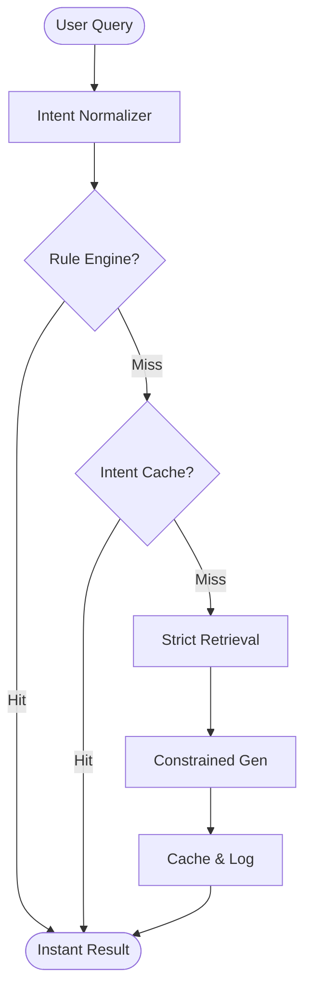

# System Architecture: Pendu Visa Engine

## High-Level Flow

## System Components

### 1. Ingestion Tier (Python)
- **Scraper**: Pulls from official government sources (IRCC, UKVI).
- **LLM Digest**: Gemini 1.5 Flash compresses prose into factual bullets.
- **Vector Store**: ChromaDB/Pinecone storing dense summary embeddings.

### 2. Logic Tier (FastAPI)
- **Intent Parser**: Normalizes queries into structural metadata.
- **Rule Engine**: Deterministic policy evaluation for known visa rules.
- **RAG Pipeline**: Coordinates strictly filtered retrieval and constrained LLM generation.

### 3. Presentation Tier (Next.js)
- **App Router**: Optimized for performance and simple state management.
- **Metrics Panel**: Real-time transparency into system performance.
- **Profile Intake**: Normalizes user state for the RAG engine.

## Determinism vs. Generative
We treat LLMs strictly as **narrative engines** for data retrieved or computed by our deterministic systems. We never allow the LLM to "decide" a policy; it only "explains" the policy retrieved from our verified fact store.
